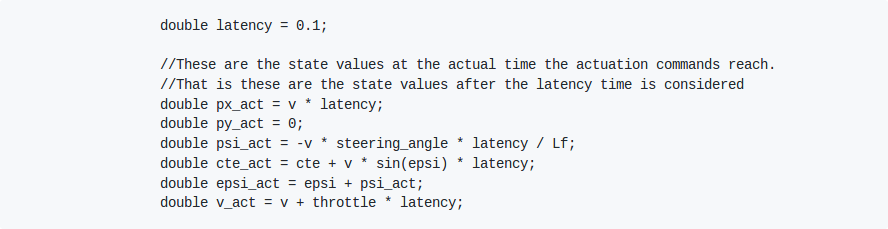

# CarND-Controls-MPC
Self-Driving Car Engineer Nanodegree Program

---

## The Model
The model used for this project is a kinematic model. Kinematic model are relatively simple to use. They are frequently used since they can be adapted for number of vehicles. Kinematic models ignore forces, mass and gravity.

### State:
The kinematic model used for this project has following variables to define state of the vehicle:
- px: x-coordinate of the vehicle in the global space
- py: x-coordinate of the vehicle in the global space
- psi: angle made by vehicle with respect to its x-axis
- v: velocity of the vehicle
- cte: Cross-track error
- epsi error: anguar error of the vehicle


### Actuators:
There are 3 main actuators for the vehicle:
1. Steering
2. Accelerator/Throttle
3. Brakes

To simplify the model, we use only 2 actuators by combining throttle and brakes into one. Full throttle corresponds to +1 while full brakes corresponds to -1. So we have only 2 actuator variables viz., `delta` for steering angle and `a` for throttle.  
Due to physical limitations of the actuators, we have to provide constrains to the actuators values.


## Timestamp Length(N) and Elapsed Duration(dt)
For better performance, we need higher value of N and lower value of dt. But, it creates large number of steps and thus increases the computational power and slows down the simulator. I have used trail-and-error method and findout N=20 and dt=0.05 are good values for this project.

## Latency
Actuators take time to execute the motion. This latency is about 100 milliseconds. To account for this delay, I have used kinematic model with latency.


---

## Dependencies

* cmake >= 3.5
 * All OSes: [click here for installation instructions](https://cmake.org/install/)
* make >= 4.1(mac, linux), 3.81(Windows)
  * Linux: make is installed by default on most Linux distros
  * Mac: [install Xcode command line tools to get make](https://developer.apple.com/xcode/features/)
  * Windows: [Click here for installation instructions](http://gnuwin32.sourceforge.net/packages/make.htm)
* gcc/g++ >= 5.4
  * Linux: gcc / g++ is installed by default on most Linux distros
  * Mac: same deal as make - [install Xcode command line tools]((https://developer.apple.com/xcode/features/)
  * Windows: recommend using [MinGW](http://www.mingw.org/)
* [uWebSockets](https://github.com/uWebSockets/uWebSockets)
  * Run either `install-mac.sh` or `install-ubuntu.sh`.
  * If you install from source, checkout to commit `e94b6e1`, i.e.
    ```
    git clone https://github.com/uWebSockets/uWebSockets
    cd uWebSockets
    git checkout e94b6e1
    ```
    Some function signatures have changed in v0.14.x. See [this PR](https://github.com/udacity/CarND-MPC-Project/pull/3) for more details.

* **Ipopt and CppAD:** Please refer to [this document](https://github.com/udacity/CarND-MPC-Project/blob/master/install_Ipopt_CppAD.md) for installation instructions.
* [Eigen](http://eigen.tuxfamily.org/index.php?title=Main_Page). This is already part of the repo so you shouldn't have to worry about it.
* Simulator. You can download these from the [releases tab](https://github.com/udacity/self-driving-car-sim/releases).
* Not a dependency but read the [DATA.md](./DATA.md) for a description of the data sent back from the simulator.


## Basic Build Instructions

1. Clone this repo.
2. Make a build directory: `mkdir build && cd build`
3. Compile: `cmake .. && make`
4. Run it: `./mpc`.


## Project Instructions and Rubric

Note: regardless of the changes you make, your project must be buildable using
cmake and make!

More information is only accessible by people who are already enrolled in Term 2
of CarND. If you are enrolled, see [the project page](https://classroom.udacity.com/nanodegrees/nd013/parts/40f38239-66b6-46ec-ae68-03afd8a601c8/modules/f1820894-8322-4bb3-81aa-b26b3c6dcbaf/lessons/b1ff3be0-c904-438e-aad3-2b5379f0e0c3/concepts/1a2255a0-e23c-44cf-8d41-39b8a3c8264a)
for instructions and the project rubric.


## References:
1. Udacity Self-Driving Car Nanodegree Program - Term 2 Lecture and Quizes
2. https://github.com/SiddharthSingi/CarND-MPC-Project
